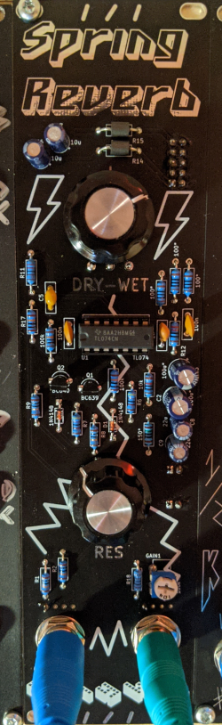

# Kosmo Spring Reverb Driver

This repository contains KiCad schematics and PCB layout for a spring reverb driver in Kosmo modular synthesizer format. It is capable to drive reverbs with an impedance from 8 to 600 ohms.

## Schematics

## Building

### Coil impedance

### BOM

## References

https://sound-au.com/articles/reverb.htm

https://kassu2000.blogspot.com/2015/10/spring-reverb.html

https://www.lookmumnocomputer.com/modular
