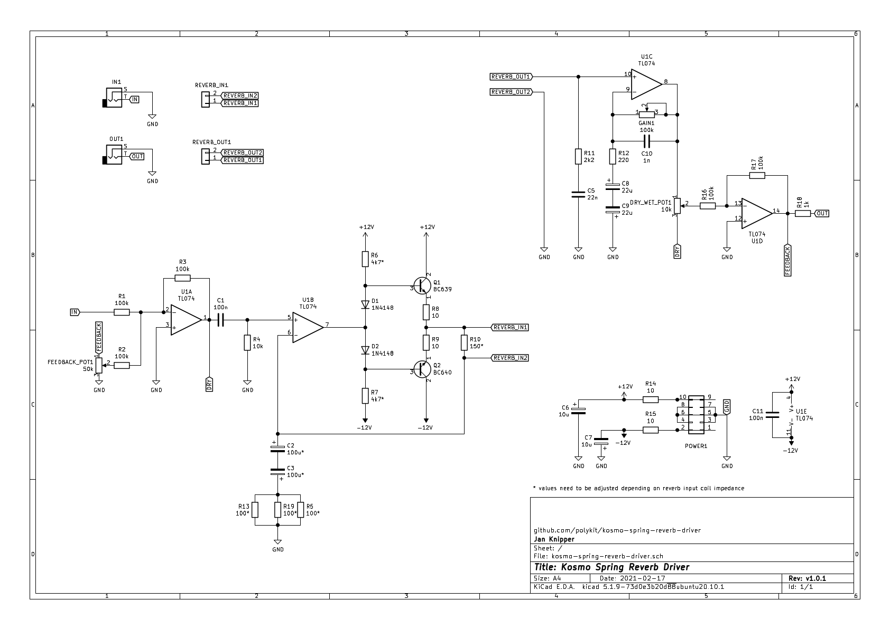

# Kosmo Spring Reverb Driver

This repository contains KiCad schematics and PCB layout for a spring reverb driver in Kosmo modular synthesizer format. It is capable to drive reverbs with an impedance from 8 to 600 ohms.

## Schematics

## Building

Just put everything in, all values are marked on the PCB. Start with the lowest profile. The board is also the front panel of the module so components stick out. It is also possible to solder most of the components on the back if wanted.

*You need a separate spring reverb tank for this module. Marked component values need to be changed depending on your reverbs impedance. The values written on the board are for 8 ohm impedance. I drive a Accutronics 4AB2A1C with it. You need to make sure that the input coil is not grounded to the tanks casing or it won't work.*

### Coil impedance

| Input Coil Impedance | R5, R13, R19 | R10     | R6, R7   | C2, C3 | 
|----------------------|--------------|---------|----------|--------|
| 8R                   | 100R         | 150R    | 4k7      | 100uF  |
| 150R                 | 470R         | 3k3     | 6k8      | 22uF   |
| 200R                 | 560R         | 3k9     | 6k8      | 22uF   |
| 250R                 | 680R         | 5k6     | 6k8      | 22uF   |
| 600R                 | 1k           | 12k     | 6k8      | 22uF   |

*Disclaimer: I only tested values for 8 ohm impedance coils. You might need to fiddle around with listed values for good results.*

### BOM

|Designator|Quantity              |Designation                                      |
|----------|----------------------|-------------------------------------------------|
|C3,C2     |2                     |100u*                                            |
|R19,R13,R5|3                     |100*                                             |
|GAIN1     |1                     |100k trimpot 5mm                                 |
|R18       |1                     |1k                                               |
|REVERB_OUT1,REVERB_IN1|2                     |2 pin connector                                  |
|C9,C8     |2                     |22u                                              |
|C7,C6     |2                     |10u                                              |
|POWER1    |1                     |IDC 10 pin male connector                        |
|C11,C1    |2                     |100n                                             |
|C10       |1                     |1n                                               |
|C5        |1                     |22n                                              |
|OUT1,IN1  |2                     |Audio Jack 6,35mm                                |
|FEEDBACK_POT1|1                     |50k pot                                          |
|DRY_WET_POT1|1                     |10k pot                                          |
|U1        |1                     |TL074                                            |
|R17,R16,R3,R2,R1|5                     |100k                                             |
|R15,R14,R9,R8|4                     |10                                               |
|R12       |1                     |220                                              |
|R11       |1                     |2k2                                              |
|R10       |1                     |150*                                             |
|R7,R6     |2                     |4k7*                                             |
|R4        |1                     |10k                                              |
|Q2        |1                     |BC640                                            |
|Q1        |1                     |BC639                                            |
|D2,D1     |2                     |1N4148                                           |

## References

https://sound-au.com/articles/reverb.htm

https://kassu2000.blogspot.com/2015/10/spring-reverb.html

https://www.lookmumnocomputer.com/modular
